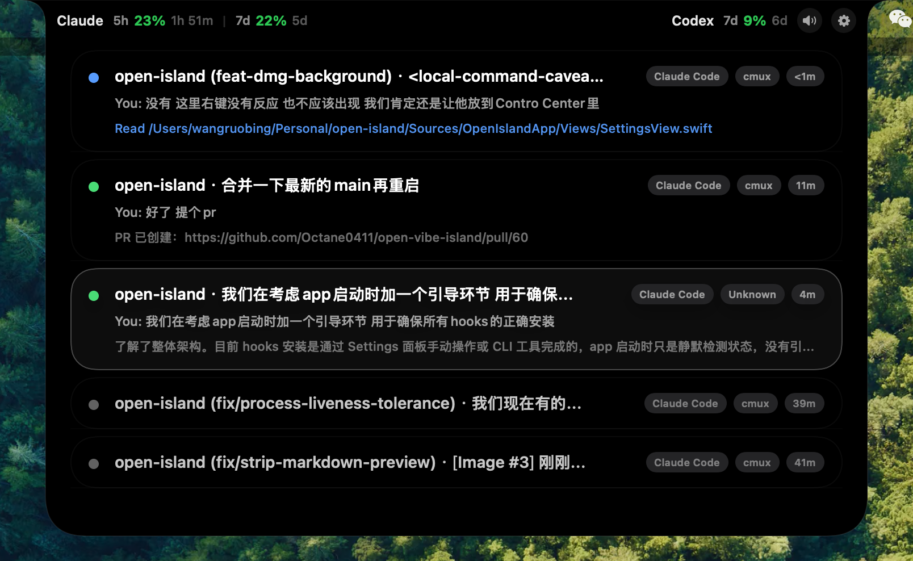

<p align="center">
  
</p>

<h1 align="center">Open Island</h1>

<p align="center">
  The open-source macOS companion for AI coding agents.
  <br>
  <a href="README.zh-CN.md">中文</a> | <strong>English</strong>
</p>

<p align="center">
  <a href="https://github.com/Octane0411/open-vibe-island/releases">Releases</a> ·
  <a href="#quick-start">Quick Start</a> ·
  <a href="#contributing">Contributing</a>
</p>

---

## Human Parts

This section is written for humans.

### What This Is

An open-source [Vibe Island](https://vibeisland.app/) alternative for heavy code-agent users on macOS. Currently supports **Claude Code** and **Codex**, with terminal integration for **Terminal.app**, **Ghostty**, and **cmux**, plus fallback detection for iTerm2, Warp, and WezTerm.

<p align="center">
  
</p>

### Motivation

I do not want to run a closed-source paid app on my own computer just to monitor my entire production flow, so I built an open-source version instead.

> you don't need to pay for a product you can vibe since you are a vibe coder

### How To Use It

- Download an early build from [GitHub Releases](https://github.com/Octane0411/open-vibe-island/releases), or build from source.
- Fork this repository and vibe your own version.
- If you hit a bug or a usage problem, open an issue. Those get the highest priority.
- If you want support for another terminal app or coding agent, open an issue first. We will expand where practical.
- If you have a product idea or feature request, open an issue first. A follow-up PR with a demo is welcome.

### Notes

This app may install hooks for Claude Code or Codex, so you may see hook-related output inside those sessions. See [docs/hooks.md](docs/hooks.md) for the full list of supported hook events and the directive protocol.

### Feature Status

#### Supported Code Agents

| Agent | Status | Description |
|---|---|---|
| **Claude Code** | Supported | Hook integration, JSONL session discovery, status line bridge, usage tracking |
| **Codex** | Supported | Full hook integration (SessionStart, UserPromptSubmit, Stop), usage tracking |
| **Cursor** | Planned | — |
| **Windsurf** | Planned | — |

#### Supported Terminals

| Terminal | Status | Description |
|---|---|---|
| **Terminal.app** | Full Support | Jump-back with TTY targeting |
| **Ghostty** | Full Support | Jump-back with ID matching |
| **cmux** | Full Support | Jump-back via Unix socket API |
| **iTerm2** | Partial | AppleScript session targeting |
| **Warp** | Planned | Fallback detection only |
| **WezTerm** | Planned | Fallback detection only |

#### Other Features

| Feature | Status | Description |
|---|---|---|
| Notch / Top-bar overlay | Supported | Notch area on notch Macs, top-center bar on others |
| Control center | Supported | Hook status, usage dashboard |
| Settings | Supported | General, Display, Sound, Shortcuts, Lab, About |
| Notification mode | Supported | Auto-height panel for permission requests and session events |
| Notification sounds | Supported | Configurable system sounds, mute toggle |
| i18n | Supported | English, Simplified Chinese |
| Session discovery | Supported | Auto-discover from local transcripts, persist across launches |
| Process discovery | Supported | Match active agents via `ps`/`lsof` |
| DMG packaging | Supported | Signing, notarization, GitHub Actions release workflow |
| Auto-update | Planned | — |

## Community

The project is still at an early stage — you may encounter issues along the way. Join the WeChat group or Discord for faster feedback and higher resolution priority.
Issues and pull requests are always welcome. We are also looking for additional maintainers — Open Island is just the beginning. Come join us:


### Report a Bug via Your Code Agent

If you run into a problem, copy the prompt below into your code agent (Claude Code, Codex, etc.) and it will automatically collect environment info and create a well-structured issue for you.

<details>
<summary>Click to expand the prompt</summary>

```
I'm having an issue with Open Island (https://github.com/Octane0411/open-vibe-island).

Please help me file a GitHub issue. Do the following:

1. Collect my environment info:
   - Run `sw_vers` to get macOS version
   - Run `swift --version` to get Swift version
   - Check if Open Island is running: `ps aux | grep -i "open.island\|OpenIslandApp" | grep -v grep`
   - Get the app version: `defaults read ~/Applications/Open\ Island\ Dev.app/Contents/Info.plist CFBundleShortVersionString 2>/dev/null || echo "unknown"`
   - Check which terminal I'm using

2. Ask me to describe:
   - What I expected to happen
   - What actually happened
   - Steps to reproduce

3. Create the issue on GitHub using `gh issue create` with this format:
   - Title: concise summary
   - Body with sections: **Environment**, **Description**, **Steps to Reproduce**, **Expected vs Actual Behavior**
   - Add label "bug" if applicable

Repository: Octane0411/open-vibe-island
```

</details>

---

## Agent Parts

This section is written for agents.

The open-source macOS companion for terminal-native AI coding.

`Open Island` puts a lightweight control surface in your notch or top bar so you can keep an eye on live coding agents, follow session progress, and jump back to the right terminal without breaking flow.

## Why This Product Exists

AI coding is becoming part of the daily development loop, but the surrounding control layer still too often means handing your machine over to a closed-source paid app.

`Open Island` takes the opposite approach:

- Open source
- Local first, no server dependency
- Native macOS (SwiftUI + AppKit)
- Built to support the terminal workflow, not replace it

## Who It Is For

Developers who already live in the terminal and want a better way to work with coding agents on macOS without losing context.

## Features

### Agent Integrations

- **Codex** — Full hook-based integration. Receives `SessionStart`, `UserPromptSubmit`, and `Stop` events by default. Reads 5-hour and 7-day account usage windows from local rollout files. Install/uninstall managed hooks from the control center or CLI.
- **Claude Code** — Hook-based integration via `~/.claude/settings.json`. Discovers sessions from `~/.claude/projects/` JSONL transcripts. Persists and restores sessions across app launches. Managed status line bridge with opt-in installation. Reads cached 5-hour and 7-day usage windows.

### Terminal Support

- **Terminal.app**, **Ghostty**, and **cmux** — Full jump-back support with session attachment matching (cmux via Unix socket API)
- **iTerm2, Warp, WezTerm** — Fallback detection and basic process discovery

### UI & Display

- **Notch overlay** — On Macs with a built-in notch, the island sits in the notch area; on external displays or non-notch Macs, it falls back to a compact top-center bar
- **Control center** — Codex/Claude hook status, usage dashboard, debug scenarios
- **Settings** — General, Display, Sound, Shortcuts, Lab (advanced), About
- **Notification mode** — Auto-height notification panel for permission requests and session events
- **Notification sounds** — Configurable system sounds (default: Bottle) with mute toggle
- **i18n** — English and Simplified Chinese

### Session Management

- Live session visibility with expandable detail rows
- Session state reducer (`SessionState.apply`) as single source of truth
- Automatic session discovery from local transcript files and cache
- Process discovery via `ps`/`lsof` for active agent matching

### Architecture

Four targets in one Swift package:

| Target | Role |
|---|---|
| **OpenIslandApp** | SwiftUI + AppKit shell — menu bar, overlay panel, control center, settings |
| **OpenIslandCore** | Shared library — models, bridge transport (Unix socket IPC), hooks, session persistence |
| **OpenIslandHooks** | Lightweight CLI invoked by agent hooks, forwards payloads via Unix socket |
| **OpenIslandSetup** | Installer CLI for managing `~/.codex/config.toml` and hook entries |

## Quick Start

Build and run locally:

```bash
open Package.swift
```

Build a local `.app` bundle:

```bash
zsh scripts/package-app.sh
```

That script creates `output/package/Open Island.app` and `output/package/Open Island.zip`. Pass `OPEN_ISLAND_SIGN_IDENTITY` to sign the bundle. See [docs/packaging.md](docs/packaging.md) for the full path, including notarization.

### Connect Codex

Open the package in Xcode to run the macOS app target. On launch, the app restores its local cache, scans recent `~/.codex/sessions/**/rollout-*.jsonl` files for existing Codex sessions, and starts the live bridge for new hook events.

The control center shows live Codex hook install status from `~/.codex`, and can install or uninstall managed hook entries directly. Installs copy the helper into `~/Library/Application Support/OpenIsland/bin/OpenIslandHooks` so repo renames do not break existing hooks.

```bash
swift build -c release --product OpenIslandHooks
swift run OpenIslandSetup install
swift run OpenIslandSetup status
swift run OpenIslandSetup uninstall
```

### Connect Claude Code

Claude usage setup is available from the app's control center and remains opt-in. The bridge writes a managed `statusLine.command` to `~/.open-island/bin/open-island-statusline`, caches `rate_limits` into `/tmp/open-island-rl.json`, and refuses to overwrite an existing custom status line automatically.

## Repository Map

- Start with [docs/index.md](docs/index.md) for the current doc map.
- Read [docs/quality.md](docs/quality.md) for the quality baseline and verification approach.
- Read [docs/hooks.md](docs/hooks.md) for all supported hook events, payload fields, and directive response formats.
- Run `scripts/harness.sh` for automated checks (docs validation, tests, build).

## Requirements

- macOS 14+
- Swift 6.2
- Xcode (for the app target)

## Product Direction

The goal is simple: make AI coding feel native on macOS.

That means:

- Less context switching
- Less tab hunting
- Less friction around session awareness
- A faster path back to the active agent session

## Contributing

The project is still at an early stage. Issues and pull requests are welcome.
