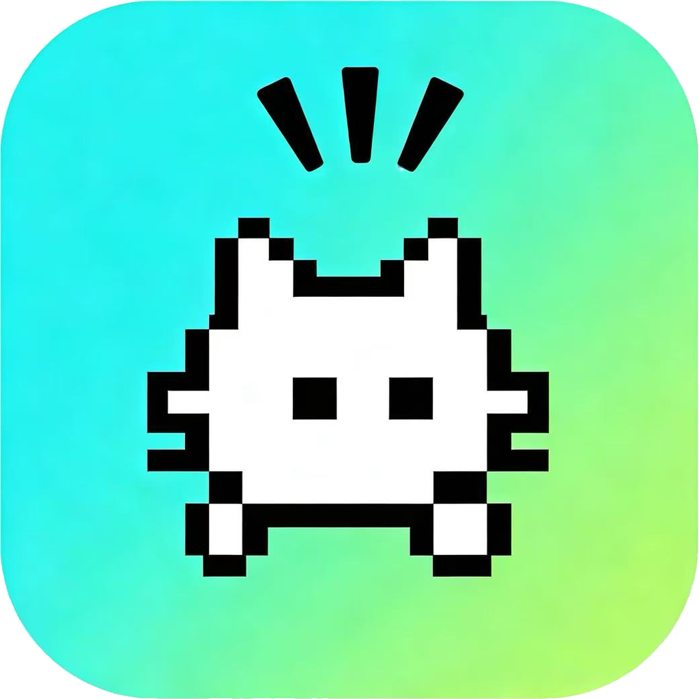
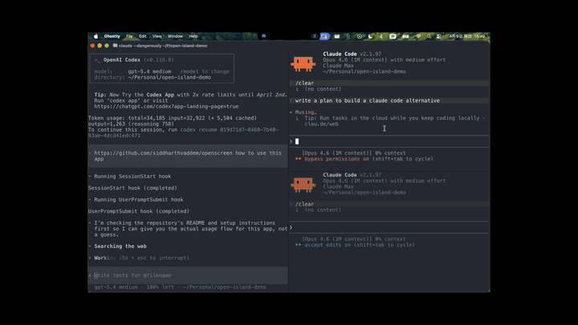

<p align="center">
  
</p>

<h1 align="center">Open Island</h1>

<p align="center">
  <strong>为什么要用闭源付费软件来监控你自己的 coding agents？</strong>
  <br>
  开源、本地优先、原生 macOS 的 AI coding agent 伴侣应用。
  <br><br>
  <strong>中文</strong> | <a href="README.md">English</a>
</p>

<p align="center">
  <a href="https://github.com/Octane0411/open-vibe-island/releases/latest"></a>
  <a href="https://github.com/Octane0411/open-vibe-island/stargazers"></a>
  <a href="https://discord.gg/bPF2HpbCFb"></a>
  <a href="LICENSE"></a>
</p>

<p align="center">
  <a href="https://github.com/Octane0411/open-vibe-island/releases">下载</a> ·
  <a href="#快速开始">快速开始</a> ·
  <a href="docs/roadmap.zh-CN.md">路线图</a> ·
  <a href="CONTRIBUTING.zh-CN.md">参与贡献</a>
</p>

<p align="center">
  
</p>

---

## Open Island 是什么？

Open Island 驻留在 Mac 的**刘海区域**（或顶部栏），为你的 AI coding agents 提供实时控制面板——会话状态、权限审批、一键跳回正确的终端。全程不打断你的工作流。

可以理解为开源版的 [Vibe Island](https://vibeisland.app/)——**免费、本地运行、代码完全属于你**。

> *You don't need to pay for a product you can vibe, since you are a vibe coder.*

## 为什么选 Open Island？

- **开源** — GPL v3，fork 它、改它、发布你自己的版本
- **本地优先** — 无服务器、无遥测、无需注册。一切在你的 Mac 上运行
- **原生 macOS** — SwiftUI + AppKit，不是 Electron 套壳
- **多 Agent** — 一个界面管理 Claude Code、Codex、Cursor、Gemini CLI、OpenCode 等
- **多终端** — 一键跳回到准确的终端/IDE 会话

## 支持的 Agents 和终端

**9 个 Agents**：Claude Code、Codex、Cursor、Gemini CLI、OpenCode、Qoder、Qwen Code、Factory、CodeBuddy

**15+ 终端和 IDE**：Terminal.app、Ghostty、iTerm2、WezTerm、Zellij、tmux、cmux、Kaku、VS Code、Cursor、Windsurf、Trae、JetBrains 全家桶（IDEA、WebStorm、PyCharm、GoLand、CLion、RubyMine、PhpStorm、Rider、RustRover）

<details>
<summary>完整兼容列表</summary>

### Code Agents

| Agent | 状态 | 说明 |
|---|---|---|
| **Claude Code** | 已支持 | Hook 集成、JSONL 会话发现、status line bridge、用量追踪 |
| **Codex** | 已支持 | 完整 hook 集成（SessionStart、UserPromptSubmit、Stop）、用量追踪 |
| **OpenCode** | 已支持 | JS 插件集成、权限/问答交互、进程检测 |
| **Qoder** | 已支持 | Claude Code 分支——相同 hook 格式，配置位于 `~/.qoder/settings.json` |
| **Qwen Code** | 已支持 | Claude Code 分支——相同 hook 格式，配置位于 `~/.qwen/settings.json` |
| **Factory** | 已支持 | Claude Code 分支——相同 hook 格式，配置位于 `~/.factory/settings.json` |
| **CodeBuddy** | 已支持 | Claude Code 分支——相同 hook 格式，配置位于 `~/.codebuddy/settings.json` |
| **Cursor** | 已支持 | Hook 集成，通过 `~/.cursor/hooks.json` 配置，会话追踪，工作区跳转 |
| **Gemini CLI** | 已支持 | Hook 集成，通过 `~/.gemini/settings.json` 配置，会话追踪，fire-and-forget 事件 |

### 终端和 IDE

| 终端 / IDE | 支持级别 | 说明 |
|---|---|---|
| **Terminal.app** | 完整 | Jump-back，TTY 定位 |
| **Ghostty** | 完整 | Jump-back，ID 匹配 |
| **cmux** | 完整 | Jump-back，Unix socket API |
| **Kaku** | 完整 | Jump-back，CLI pane 定位 |
| **WezTerm** | 完整 | Jump-back，CLI pane 定位 |
| **iTerm2** | 完整 | Jump-back，session ID / TTY 匹配 |
| **tmux**（终端复用器） | 完整 | Jump-back，session/window/pane 定位 |
| **Zellij** | 完整 | Jump-back，CLI pane/tab 定位 |
| **VS Code** | 工作区 | 通过 `code` CLI 激活工作区 |
| **Cursor** | 工作区 | 通过 `cursor` CLI 激活工作区 |
| **Windsurf** | 工作区 | 通过 `windsurf` CLI 激活工作区 |
| **Trae** | 工作区 | 通过 `trae` CLI 激活工作区 |
| **JetBrains 全家桶** | 工作区 | IDEA、WebStorm、PyCharm、GoLand、CLion、RubyMine、PhpStorm、Rider、RustRover |
| **Warp** | 完整支持 | 通过 SQLite pane 查找 + AX 菜单点击精准跳转到目标 tab |

### 其他功能

| 功能 | 说明 |
|---|---|
| 刘海 / 顶部栏覆盖层 | 刘海 Mac 在刘海区域，其他 Mac 顶部居中栏 |
| 控制中心 | Hook 状态、用量仪表盘 |
| 通知模式 | 自适应高度面板，用于权限请求和会话事件 |
| 通知音效 | 可配置系统音效、静音切换 |
| 国际化 | English、简体中文 |
| 会话发现 | 从本地 transcript 自动发现，跨启动持久化 |
| 自动更新 | 基于 Sparkle 的自动更新 |
| 签名公证 | DMG 打包，Apple 公证 |

</details>

## 快速开始

### 方式一：直接下载

从 [GitHub Releases](https://github.com/Octane0411/open-vibe-island/releases) 下载最新 DMG——已签名公证，开箱即用。

### 方式二：从源码构建

```bash
git clone https://github.com/Octane0411/open-vibe-island.git
cd open-vibe-island
open Package.swift   # 在 Xcode 中打开，点击 Run
```

首次启动时，Open Island 会自动发现活跃的 agent 会话并启动 live bridge。Hook 安装在 app 内的**控制中心**管理。

> **系统要求**：macOS 14+、Swift 6.2、Xcode

## 工作原理

```
Agent（Claude Code / Codex / Cursor / ...）
  ↓ hook 事件
OpenIslandHooks CLI（stdin → Unix socket）
  ↓ JSON envelope
BridgeServer（app 内）
  ↓ 状态更新
Notch 覆盖层 UI ← 你在这里看到它
  ↓ 点击
跳回 → 正确的终端 / IDE
```

Hooks **fail open**——如果 Open Island 没在运行，你的 agents 不受任何影响。

<details>
<summary>架构详情</summary>

一个 Swift package 中的四个 target：

| Target | 角色 |
|---|---|
| **OpenIslandApp** | SwiftUI + AppKit shell——菜单栏、覆盖面板、控制中心、设置 |
| **OpenIslandCore** | 共享库——模型、bridge 传输（Unix socket IPC）、hooks、会话持久化 |
| **OpenIslandHooks** | 轻量 CLI，由 agent hooks 调用，通过 Unix socket 转发 payload |
| **OpenIslandSetup** | 安装器 CLI，管理 `~/.codex/config.toml` 和 hook entries |

详见 [docs/architecture.md](docs/architecture.md)。

</details>

## 社区

加入 **Discord** 参与讨论、反馈和更快的问题响应：

[](https://discord.gg/bPF2HpbCFb)

我们欢迎 issue、pull request 和新的 maintainer。详见 [CONTRIBUTING.zh-CN.md](CONTRIBUTING.zh-CN.md)。

<details>
<summary>微信群</summary>


</details>

## 通过 Code Agent 提交 Bug

遇到问题？把下面的 prompt 复制到你的 agent（Claude Code、Codex 等）中，它会自动收集环境信息并创建规范的 issue：

<details>
<summary>点击展开</summary>

```
我在使用 Open Island (https://github.com/Octane0411/open-vibe-island) 时遇到了问题。

请帮我提交一个 GitHub issue，按以下步骤操作：

1. 收集我的环境信息：
   - 运行 `sw_vers` 获取 macOS 版本
   - 运行 `swift --version` 获取 Swift 版本
   - 检查 Open Island 是否在运行：`ps aux | grep -i "open.island\|OpenIslandApp" | grep -v grep`
   - 获取 app 版本：`defaults read ~/Applications/Open\ Island\ Dev.app/Contents/Info.plist CFBundleShortVersionString 2>/dev/null || echo "unknown"`
   - 检查我当前使用的终端

2. 询问我：
   - 期望的行为是什么
   - 实际发生了什么
   - 复现步骤

3. 使用 `gh issue create` 在 GitHub 上创建 issue，格式如下：
   - 标题：简洁的问题概述
   - 正文包含以下部分：**环境信息**、**问题描述**、**复现步骤**、**期望行为 vs 实际行为**
   - 如果是 bug 请添加 "bug" 标签

仓库：Octane0411/open-vibe-island
```

</details>

## Star History

<a href="https://star-history.com/#Octane0411/open-vibe-island&Date">
 <picture>
   <source media="(prefers-color-scheme: dark)" srcset="https://api.star-history.com/svg?repos=Octane0411/open-vibe-island&type=Date&theme=dark" />
   <source media="(prefers-color-scheme: light)" srcset="https://api.star-history.com/svg?repos=Octane0411/open-vibe-island&type=Date" />
   
 </picture>
</a>

## Contributors

<a href="https://github.com/Octane0411/open-vibe-island/graphs/contributors">
  <!-- CONTRIBUTORS-IMG:START -->
  
  <!-- CONTRIBUTORS-IMG:END -->
</a>

## 路线图

详见 [docs/roadmap.zh-CN.md](docs/roadmap.zh-CN.md)。

---

## Agent Parts

这部分内容是给 agents 阅读的。

这是一个面向终端原生 AI coding 工作流的开源 macOS companion app。

`Open Island` 会在刘海区域或顶部栏放置一个轻量控制界面，让你可以在不中断当前 flow 的前提下观察 live coding agents、跟踪会话进度，并快速跳回正确的 terminal 上下文。

### 为什么会有这个产品

AI coding 正在成为日常开发流程的一部分，但围绕它的控制层仍然经常意味着把你的机器交给一个闭源、收费的 app。

`Open Island` 选择了相反的路线：

- 开源
- Local first，无服务器依赖
- 原生 macOS（SwiftUI + AppKit）
- 适配 terminal 工作流，而不是替代它

### 适合谁

已经长期工作在 terminal 里的开发者，希望在 macOS 上和 coding agents 协作时拥有更好的上下文感，而不是在工具之间来回丢失状态。

### Agent 集成

- **Codex** — 完整的 hook 集成。默认接收 `SessionStart`、`UserPromptSubmit` 和 `Stop` 事件。从本地 rollout 文件读取 5 小时和 7 天 account usage windows。支持从控制中心或 CLI 安装/卸载受管 hooks。
- **Claude Code** — 基于 hook 的集成，通过 `~/.claude/settings.json` 配置。从 `~/.claude/projects/` JSONL transcript 自动发现会话。跨应用启动持久化和恢复会话。受管 status line bridge，opt-in 安装。读取缓存的 5 小时和 7 天 usage windows。
- **OpenCode** — JS 插件集成，通过 `~/.config/opencode/plugins/`。首次启动自动安装插件。接收会话生命周期、工具使用、权限和问答事件。支持权限审批和问答交互。通过 `ps` 进行进程检测。
- **Qoder** — Claude Code 分支。相同 hook 格式和事件，配置位于 `~/.qoder/settings.json`。使用 `--source qoder` 调用 hooks binary。
- **Qwen Code** — Claude Code 分支。相同 hook 格式和事件，配置位于 `~/.qwen/settings.json`。使用 `--source qwen` 调用 hooks binary。
- **Factory** — Claude Code 分支。相同 hook 格式和事件，配置位于 `~/.factory/settings.json`。使用 `--source factory` 调用 hooks binary。
- **CodeBuddy** — Claude Code 分支。相同 hook 格式和事件，配置位于 `~/.codebuddy/settings.json`。使用 `--source codebuddy` 调用 hooks binary。
- **Cursor** — 基于 hook 的集成，通过 `~/.cursor/hooks.json` 配置。接收 `beforeSubmitPrompt`、`beforeShellExecution`、`beforeMCPExecution`、`beforeReadFile`、`afterFileEdit` 和 `stop` 事件。跨应用启动持久化会话。通过 `cursor -r` 跳回工作区。使用 `--source cursor` 调用 hooks binary。
- **Gemini CLI** — 基于 hook 的集成，通过 `~/.gemini/settings.json` 配置。接收 `SessionStart`、`PreToolUse`、`PostToolUse`、`Stop` 和 `UserPromptSubmit` 事件。Fire-and-forget（无 block/deny）。使用 `--source gemini` 调用 hooks binary。

### 终端支持

- **Terminal.app**、**Ghostty**、**cmux**、**Kaku**、**WezTerm**、**iTerm2** 和 **Zellij** — 完整的 jump-back 支持，带会话附着匹配（cmux 通过 Unix socket API，Kaku/WezTerm/Zellij 通过 CLI pane 定位，iTerm2 通过 AppleScript session/TTY 探针）
- **VS Code**、**VS Code Insiders**、**Cursor**、**Windsurf**、**Trae** — 工作区级跳转，通过对应 CLI（`code -r`、`cursor -r` 等）
- **JetBrains 全家桶**（IntelliJ IDEA、WebStorm、PyCharm、GoLand、CLion、RubyMine、PhpStorm、Rider、RustRover） — 工作区级跳转，通过 IDE CLI launcher
- **Warp** — 通过 SQLite pane 查找、pid 进程树消歧和 AX 菜单点击实现精准 tab 跳转

### UI 与显示

- **刘海覆盖层** — 在有刘海的 Mac 上，island 位于刘海区域；在外接显示器或无刘海 Mac 上，降级为紧凑的顶部居中栏
- **控制中心** — Codex/Claude hook 状态、用量仪表盘、调试场景
- **设置** — 通用、显示、声音、快捷键、实验室（高级）、关于
- **通知模式** — 自适应高度的通知面板，用于权限请求和会话事件
- **通知音效** — 可配置的系统音效（默认：Bottle），支持静音切换
- **国际化** — 英文和简体中文

### 会话管理

- Live session 可见性，支持可展开的详情行
- Session state reducer（`SessionState.apply`）作为唯一真相源
- 从本地 transcript 文件和缓存自动发现会话
- 通过 `ps`/`lsof` 进行进程发现，匹配活跃的 agent

### 架构

一个 Swift package 中的四个 target：

| Target | 角色 |
|---|---|
| **OpenIslandApp** | SwiftUI + AppKit shell — 菜单栏、覆盖面板、控制中心、设置 |
| **OpenIslandCore** | 共享库 — 模型、bridge 传输（Unix socket IPC）、hooks、会话持久化 |
| **OpenIslandHooks** | 轻量 CLI，由 agent hooks 调用，通过 Unix socket 转发 payload |
| **OpenIslandSetup** | 安装器 CLI，管理 `~/.codex/config.toml` 和 hook entries |

### 快速开始（Agent）

本地构建并运行：

```bash
open Package.swift
```

构建本地 `.app` 包：

```bash
zsh scripts/package-app.sh
```

该脚本会创建 `output/package/Open Island.app` 和 `output/package/Open Island.zip`。传入 `OPEN_ISLAND_SIGN_IDENTITY` 可以签名。详见 [docs/packaging.md](docs/packaging.md)。

#### 连接 Codex

在 Xcode 中打开 package 并运行 macOS app target。启动时，app 会恢复本地缓存，扫描最近的 `~/.codex/sessions/**/rollout-*.jsonl` 文件来恢复已有 Codex sessions，然后启动 live bridge 接收新 hook events。

控制中心展示来自 `~/.codex` 的实时 Codex hook 安装状态，并可直接安装或卸载受管 hook entries。安装过程会把 helper 复制到 `~/Library/Application Support/OpenIsland/bin/OpenIslandHooks`，repo 重命名不会破坏已有 hooks。

```bash
swift build -c release --product OpenIslandHooks
swift run OpenIslandSetup install
swift run OpenIslandSetup status
swift run OpenIslandSetup uninstall
```

#### 连接 Claude Code

Claude usage 设置可在 app 控制中心启用，保持 opt-in。bridge 会把受管 `statusLine.command` 写入 `~/.open-island/bin/open-island-statusline`，把 `rate_limits` 缓存到 `/tmp/open-island-rl.json`，不会自动覆盖已有的自定义 status line。

### 仓库导航

- 从 [docs/index.md](docs/index.md) 开始查看文档地图。
- 阅读 [docs/quality.md](docs/quality.md) 了解质量基线和验证方式。
- 阅读 [docs/hooks.md](docs/hooks.md) 了解所有支持的 hook 事件、payload 字段和 directive 响应格式。
- 运行 `scripts/harness.sh` 进行自动化检查（文档验证、测试、构建）。

### 系统要求

- macOS 14+
- Swift 6.2
- Xcode（用于 app target）

---

## License

[GPL v3](LICENSE)
